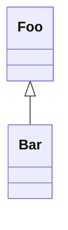

# template-bun-executable

[](https://github.com/flowscripter/template-bun-executable/releases)
[](https://github.com/flowscripter/template-bun-executable/actions/workflows/release-bun-executable.yml)
[](https://codecov.io/gh/flowscripter/template-bun-executable)
[](https://flowscripter.github.io/template-bun-executable/index.html)
[](https://github.com/flowscripter/template-bun-executable/blob/main/LICENSE)

> Project template for a cross-platform Bun executable with ffi native library
> and Bun library dependencies

## Template Usage

Create a new Bun project using this as a template:

`bun create @flowscripter/template-bun-executable`

## Bun Module Usage

Add the module:

`bun add @flowscripter/template-bun-executable`

Use the module:

```typescript
import { world } from "@flowscripter/template-bun-executable";

world();
```

## Binary Executable Usage

**NOTE**: The binaries are 10's of megabytes in size as the entire Bun runtime
is included.

#### MacOS

Via [Homebrew](https://brew.sh/):

`brew install flowscripter/tap/template-bun-executable`

#### Linux

In a terminal:

`curl -fsSL https://raw.githubusercontent.com/flowscripter/template-bun-executable/main/script/install.sh | sh`

#### Windows

In PowerShell:

`curl -fsSL https://raw.githubusercontent.com/flowscripter/template-bun-executable/main/script/install.ps1 | powershell`

#### Manual Install

You can download and extract the binary zip files from the
[releases](https://github.com/flowscripter/template-bun-executable/releases)
page.

## Functional Tests

Refer to [functional_tests/README.md](functional_tests/README.md)

## Development

Test:

`bun test`

Compile binary:

`bun build index.ts --compile --outfile /tmp/template-bun-executable`

**NOTE**: The following tasks use Deno as it excels at these and Bun does not
currently provide such functionality:

Format:

`deno fmt`

Lint:

`deno lint index.ts src/ tests/`

Generate HTML API Documentation:

`deno doc --html --name=template-bun-executable index.ts`

## Documentation

### Overview

Sample mermaid diagram to test rendering in markdown:



### API

Link to auto-generated API docs:

[API Documentation](https://flowscripter.github.io/template-bun-executable/index.html)

## License

MIT © Flowscripter
